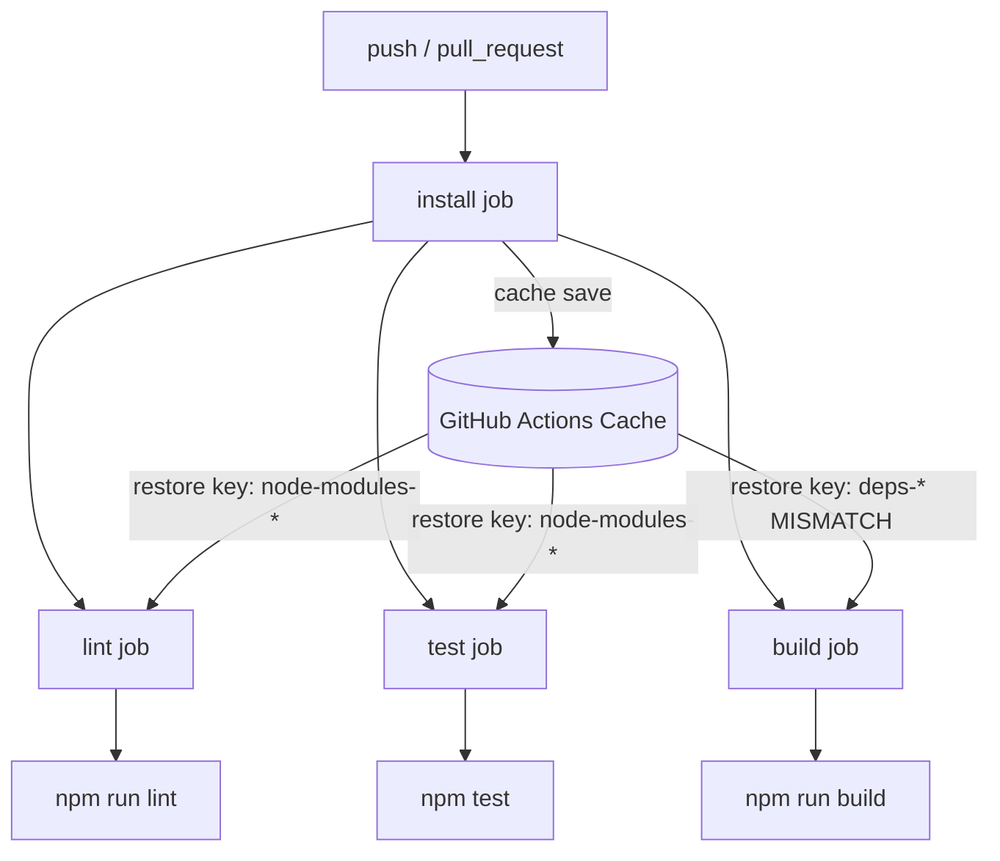

# CI Pipeline Diagnosis — `ci.yaml`

**Investigated file:** `codebase/rdicidr-0.1.0/.github/workflows/ci.yaml`  
**Date:** 2026-07-12  
**Scope:** Static analysis of the workflow and its runtime dependencies (`package.json`, `package-lock.json`, `.npmrc`, `.nvmrc`, `Dockerfile`). The workflow file itself was not modified.

---

## Executive Summary

The CI pipeline has **7 confirmed defects** that will cause failures at different stages. The most severe blockers are:

1. The workflow may **never be discovered by GitHub Actions** due to its nested path.
2. The **`install` job will fail on `npm ci`** because Node/npm versions violate `engine-strict` and `package-lock.json` is out of sync with `package.json`.
3. The **`build` job will fail** even if `install` succeeds, due to a cache key mismatch that leaves `node_modules` empty.

---

## Pipeline Overview



| Job     | Depends on | Command              | Node version in CI |
|---------|------------|----------------------|--------------------|
| install | —          | `npm ci`             | 14                 |
| lint    | install    | `npm run lint`       | 14                 |
| test    | install    | `npm test -- --watchAll=false` | 14       |
| build   | install    | `npm run build`      | 14                 |

---

## Defect Catalog

### DEFECT-01 — Workflow file is not at the GitHub Actions discovery path

| Field | Detail |
|-------|--------|
| **Location** | Entire workflow file placement |
| **Severity** | Critical (pipeline may never run) |
| **Affected jobs** | All (`install`, `lint`, `test`, `build`) |

**What is wrong**

The workflow lives at:

```
codebase/rdicidr-0.1.0/.github/workflows/ci.yaml
```

GitHub Actions only auto-discovers workflows under:

```
<repository-root>/.github/workflows/
```

The git repository root is `assessment-cc-agentic-devops-aws-kubernetes-sr-01/`, which has **no** `.github/workflows/` directory at the root.

**Root cause**

The workflow was placed inside the application subdirectory instead of the repository root (or the subdirectory was expected to be the standalone repo root).

**Where it causes an error**

- GitHub repository → **Actions tab shows no workflow runs** (workflow never triggers).
- If manually invoked or relocated without fixing paths, all `npm` steps fail because they run from the wrong working directory (see DEFECT-02).

**Recommended fix**

Move the workflow to `.github/workflows/ci.yaml` at the repository root and add `defaults.run.working-directory: codebase/rdicidr-0.1.0` (or equivalent per-step `working-directory`).

---

### DEFECT-02 — No `working-directory` set; npm commands run from repo root

| Field | Detail |
|-------|--------|
| **Location** | All jobs, all `run:` steps and `hashFiles()` calls |
| **Severity** | Critical |
| **Affected jobs** | `install`, `lint`, `test`, `build` |

**What is wrong**

Every job runs `npm ci`, `npm run lint`, `npm test`, and `npm run build` from the GitHub Actions workspace root. The Node project (with `package.json`) is in `codebase/rdicidr-0.1.0/`.

**Root cause**

Missing `defaults.run.working-directory` at the workflow level or per-step `working-directory`.

**Where it causes an error**

| Step | Error |
|------|-------|
| `npm ci` (install) | `ENOENT: no such file or directory, open 'package.json'` |
| `npm run lint` (lint) | Same — no `package.json` at cwd |
| `npm test` (test) | Same |
| `npm run build` (build) | Same |

**Dependency chain**

```
actions/checkout → cwd = repo root → npm ci → FAIL (no package.json)
```

Downstream jobs never receive a valid cache because `install` never completes successfully.

**Recommended fix**

Add to workflow:

```yaml
defaults:
  run:
    working-directory: codebase/rdicidr-0.1.0
```

---

### DEFECT-03 — Node.js version mismatch (CI uses 14, project requires 15.x)

| Field | Detail |
|-------|--------|
| **Location** | Lines 19, 33, 47, 61 — `node-version: '14'` in all four jobs |
| **Severity** | Critical |
| **Affected jobs** | `install` (first failure point), then all downstream jobs |

**What is wrong**

CI pins Node **14** in every job, but the project explicitly requires Node **15.x**.

**Conflicting sources**

| File | Required Node version |
|------|-----------------------|
| `ci.yaml` | `'14'` |
| `package.json` → `engines.node` | `>=15.0.0 <16.0.0` |
| `package-lock.json` → `engines.node` | `>=15.0.0 <16.0.0` |
| `.nvmrc` | `15.5.1` |
| `Dockerfile` | `node:15-alpine` |

**Root cause**

`setup-node` version was set to 14, inconsistent with every other project artifact that defines the runtime.

**Where it causes an error**

With `.npmrc` containing `engine-strict=true` (see DEFECT-04), the `install` job fails at `npm ci`:

```
npm ERR! code EBADENGINE
npm ERR! engine Unsupported engine
npm ERR! engine Not compatible with your version of node/npm: rdicidr@0.1.0
npm ERR! notsup Required: {"node":">=15.0.0 <16.0.0", ...}
npm ERR! notsup Actual:   {"npm":"6.x.x","node":"14.x.x"}
```

Even without `engine-strict`, `node-sass@5.0.0` native binary compilation is validated against the runtime Node version and may fail or behave incorrectly on Node 14 when the lockfile was produced for Node 15.

**Dependency chain**

```
setup-node@v3 (node 14)
  → .npmrc (engine-strict=true)
    → package.json engines (node >=15 <16)
      → npm ci → EBADENGINE → install job FAIL
        → lint, test, build skipped (needs: install)
```

**Recommended fix**

Set `node-version: '15'` (or read from `.nvmrc` via `node-version-file`) in all jobs.

---

### DEFECT-04 — npm version mismatch (CI Node 14 ships npm 6.x, project requires npm 7.x)

| Field | Detail |
|-------|--------|
| **Location** | Implicit via `actions/setup-node@v3` with `node-version: '14'` |
| **Severity** | Critical (combined with DEFECT-03) |
| **Affected jobs** | `install` |

**What is wrong**

| File | Required npm version |
|------|---------------------|
| `package.json` → `engines.npm` | `>=7.0.0 <8.0.0` |
| `package-lock.json` → `engines.npm` | `>=7.0.0 <9.0.0` |
| Node 14 on `ubuntu-latest` (via setup-node) | npm **6.14.x** (bundled) |
| Node 15 on `ubuntu-latest` (via setup-node) | npm **7.x** (bundled) |

**Root cause**

Node 14 bundles npm 6, which violates the `engines.npm` constraint. The lockfile (`lockfileVersion: 2`) also requires npm 7+.

**Where it causes an error**

`install` job → `npm ci`:

```
npm ERR! code EBADENGINE
npm ERR! engine Not compatible with your version of node/npm
npm ERR! notsup Required: {"npm":">=7.0.0 <8.0.0"}
npm ERR! notsup Actual:   {"npm":"6.14.18","node":"14.21.3"}
```

**Enabling configuration**

`.npmrc`:

```
engine-strict=true
```

This setting converts engine mismatches from warnings into **hard failures**.

**Dependency chain**

```
.npmrc (engine-strict=true)
  + package.json engines (npm >=7)
  + setup-node (node 14 → npm 6)
    → npm ci → EBADENGINE
```

**Recommended fix**

Use Node 15 (ships npm 7.x), or explicitly set `cache: 'npm'` and a compatible npm version via `setup-node`.

---

### DEFECT-05 — `package-lock.json` out of sync with `package.json`

| Field | Detail |
|-------|--------|
| **Location** | `install` job → `npm ci` step; dependency: `package.json` vs `package-lock.json` |
| **Severity** | Critical |
| **Affected jobs** | `install` (blocks all others) |

**What is wrong**

`package.json` declares `prettier` as a direct dependency:

```json
"prettier": "3.3.1"
```

`package-lock.json` root `packages[""].dependencies` does **not** include `prettier`, and there is no `node_modules/prettier` entry in the lockfile.

**Root cause**

`package.json` was modified (prettier added) without running `npm install` to regenerate the lockfile.

**Where it causes an error**

`install` job → `npm ci`:

```
npm ERR! `npm ci` can only install packages when your package.json and package-lock.json are in sync.
npm ERR! Missing: prettier@3.3.1 from lock file
```

**Additional inconsistency**

| Field | `package.json` | `package-lock.json` |
|-------|----------------|---------------------|
| `engines.npm` | `>=7.0.0 <8.0.0` | `>=7.0.0 <9.0.0` |

**Dependency chain**

```
package.json (prettier added)
  ≠ package-lock.json (prettier absent)
    → npm ci → sync error → install FAIL
```

**Recommended fix**

Run `npm install` with Node 15 / npm 7 locally and commit the updated `package-lock.json`.

---

### DEFECT-06 — Cache key mismatch in `build` job

| Field | Detail |
|-------|--------|
| **Location** | `build` job, lines 63–65 |
| **Severity** | High |
| **Affected jobs** | `build` |

**What is wrong**

| Job | Cache key |
|-----|-----------|
| `install` (save) | `node-modules-${{ hashFiles('package-lock.json') }}` |
| `lint` (restore) | `node-modules-${{ hashFiles('package-lock.json') }}` |
| `test` (restore) | `node-modules-${{ hashFiles('package-lock.json') }}` |
| `build` (restore) | `deps-${{ hashFiles('package-lock.json') }}` ← **different prefix** |

**Root cause**

Typo / copy-paste error: `build` uses `deps-` prefix while `install` saves with `node-modules-` prefix.

**Where it causes an error**

`build` job → cache restore step:

- Cache lookup for `deps-<hash>` finds **no match** (cache was saved as `node-modules-<hash>`).
- Restore completes with a cache miss; `node_modules` is not populated.
- `npm run build` fails:

```
sh: 1: react-scripts: not found
```

or:

```
npm ERR! missing script: build   (if react-scripts not in PATH)
Cannot find module 'react-scripts/package.json'
```

**Dependency chain**

```
install job → cache/save (key: node-modules-*)
  → build job → cache/restore (key: deps-*) → MISS
    → no node_modules
      → npm run build → FAIL
```

**Recommended fix**

Change `build` restore key to `node-modules-${{ hashFiles('package-lock.json') }}` to match `install`, `lint`, and `test`.

---

### DEFECT-07 — Downstream jobs have no fallback when cache restore misses

| Field | Detail |
|-------|--------|
| **Location** | `lint`, `test`, `build` jobs — after `actions/cache/restore@v3` |
| **Severity** | Medium (amplifies DEFECT-06; also fails on first run or cache eviction) |
| **Affected jobs** | `lint`, `test`, `build` |

**What is wrong**

`lint`, `test`, and `build` restore `node_modules` from cache but never run `npm ci` if the restore misses.

**Root cause**

Assumption that cache restore always succeeds. GitHub Actions cache is best-effort and can miss on first run, after key changes, after 7-day eviction, or due to key typos.

**Where it causes an error**

Any cache miss in `lint`:

```
> eslint ./src/
sh: 1: eslint: not found
```

Any cache miss in `test`:

```
> react-scripts test
sh: 1: react-scripts: not found
```

Any cache miss in `build` (guaranteed today due to DEFECT-06):

```
> react-scripts build
sh: 1: react-scripts: not found
```

**Dependency chain**

```
cache/restore → miss (no fallback npm ci)
  → npm run <script> → binary not in node_modules/.bin → FAIL
```

**Recommended fix**

Add `npm ci` after cache restore in downstream jobs, or use a single `actions/cache@v3` step with `cache: 'npm'` in each job (simpler and more resilient).

---

### DEFECT-08 — ESLint Prettier plugin missing; `lint` job will fail

| Field | Detail |
|-------|--------|
| **Location** | `lint` job → `npm run lint`; config in `package.json` |
| **Severity** | High (after install succeeds) |
| **Affected jobs** | `lint` |

**What is wrong**

`package.json` ESLint config extends `plugin:prettier/recommended`:

```json
"eslintConfig": {
  "extends": [
    "react-app",
    "react-app/jest",
    "plugin:prettier/recommended"
  ]
}
```

Neither `eslint-plugin-prettier` nor `eslint-config-prettier` are listed in `package.json` dependencies or anywhere in `package-lock.json`.

**Root cause**

ESLint shareable config `plugin:prettier/recommended` was added to `eslintConfig` without installing the required npm packages.

**Where it causes an error**

`lint` job → `npm run lint` → `eslint ./src/`:

```
Failed to load plugin 'prettier' declared in 'package.json': Cannot find module 'eslint-plugin-prettier'
```

or:

```
ESLint couldn't find the config "plugin:prettier/recommended"
```

**Dependency chain**

```
package.json eslintConfig (plugin:prettier/recommended)
  → eslint ./src/
    → resolve eslint-plugin-prettier → NOT INSTALLED → lint FAIL
```

**Recommended fix**

Install `eslint-config-prettier` and `eslint-plugin-prettier` as devDependencies and update the lockfile.

---

## Failure Order (Predicted Run Sequence)

Assuming the workflow is relocated to the correct GitHub path but other defects remain:

| Order | Job | Step | Failure | Defect |
|-------|-----|------|---------|--------|
| 1 | install | `npm ci` | EBADENGINE (Node 14 / npm 6) | DEFECT-03, DEFECT-04 |
| 1b | install | `npm ci` | Lockfile sync error (prettier) | DEFECT-05 |
| 2 | lint, test, build | — | Skipped (`needs: install` failed) | cascade |
| — | build | cache restore + `npm run build` | Always fails even if install passes | DEFECT-06 |
| — | lint | `npm run lint` | ESLint plugin missing | DEFECT-08 |

If the workflow is **not** moved to repo root (DEFECT-01) and no `working-directory` is set (DEFECT-02):

| Order | Job | Step | Failure |
|-------|-----|------|---------|
| 1 | install | `npm ci` | `package.json` not found at repo root |

---

## Dependency Map

```
ci.yaml
├── actions/checkout@v3          → provides source tree
├── actions/setup-node@v3        → Node 14 / npm 6  ← DEFECT-03, DEFECT-04
│   ├── .npmrc (engine-strict)   → hard-fail on engine mismatch
│   ├── package.json engines     → node >=15, npm >=7
│   ├── .nvmrc                   → 15.5.1
│   └── Dockerfile               → node:15-alpine
├── npm ci                       ← DEFECT-02 (cwd), DEFECT-05 (lock sync)
│   ├── package.json
│   ├── package-lock.json
│   └── node-sass@5.0.0          → native bindings tied to Node version
├── actions/cache/save@v3        → key: node-modules-*
├── actions/cache/restore@v3
│   ├── lint/test: node-modules-*  ✓
│   └── build: deps-*              ✗ DEFECT-06
├── npm run lint                 ← DEFECT-08 (eslint-plugin-prettier missing)
├── npm test -- --watchAll=false → react-scripts (needs node_modules)
└── npm run build                → react-scripts (needs node_modules + node-sass)
```

---

## Recommended Fix Priority

| Priority | Defect | Action |
|----------|--------|--------|
| P0 | DEFECT-01 | Move workflow to `<repo-root>/.github/workflows/ci.yaml` |
| P0 | DEFECT-02 | Add `working-directory: codebase/rdicidr-0.1.0` |
| P0 | DEFECT-03, DEFECT-04 | Change `node-version` to `'15'` in all jobs |
| P0 | DEFECT-05 | Regenerate `package-lock.json` (`npm install` on Node 15) |
| P1 | DEFECT-06 | Align `build` cache key with `node-modules-*` |
| P1 | DEFECT-08 | Install `eslint-plugin-prettier` + `eslint-config-prettier` |
| P2 | DEFECT-07 | Add `npm ci` fallback in downstream jobs or simplify caching |

---

## Files Referenced (not modified)

| File | Role |
|------|------|
| `codebase/rdicidr-0.1.0/.github/workflows/ci.yaml` | CI workflow under investigation |
| `codebase/rdicidr-0.1.0/package.json` | Engine constraints, scripts, ESLint config |
| `codebase/rdicidr-0.1.0/package-lock.json` | Lockfile consumed by `npm ci` |
| `codebase/rdicidr-0.1.0/.npmrc` | `engine-strict=true` |
| `codebase/rdicidr-0.1.0/.nvmrc` | Local Node version pin (`15.5.1`) |
| `codebase/rdicidr-0.1.0/Dockerfile` | Production build uses `node:15-alpine` |
