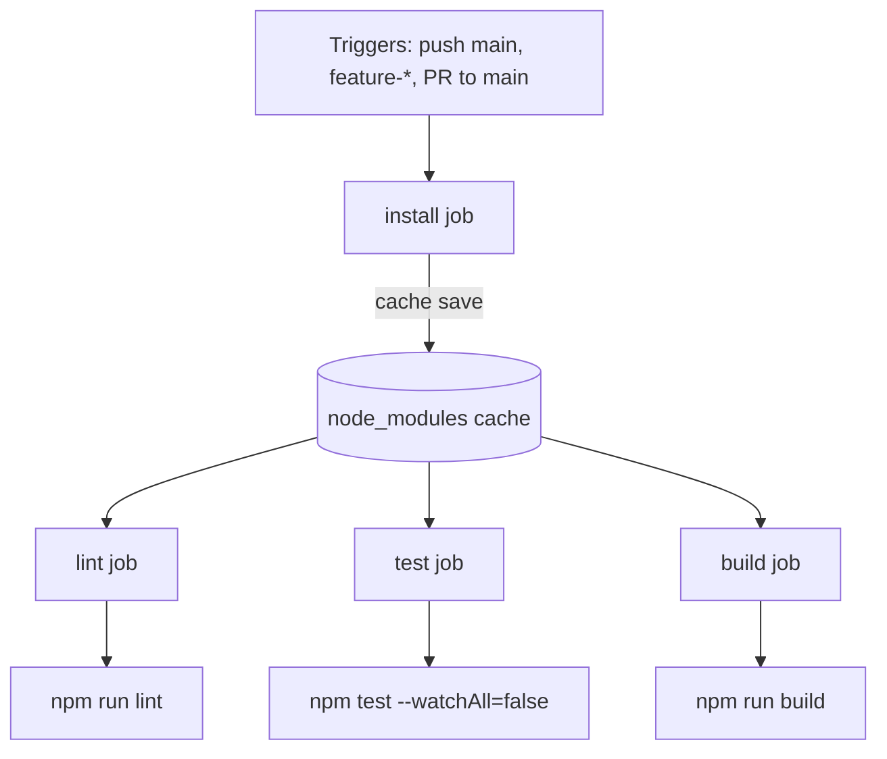

# CI Pipeline Diagnosis — rdicidr-0.1.0

**Investigation date:** 2026-07-12  
**Scope:** `codebase/rdicidr-0.1.0/.github/workflows/ci.yaml` and downstream source/config impact  
**Method:** Static analysis of workflow + project config; Docker reproduction with `node:14` and `node:15` images matching CI/Dockerfile expectations  
**Status:** Investigation only — no fixes applied

---

## Executive Summary

The CI pipeline is **non-functional end-to-end**. GitHub Actions does not register the workflow at all in this repository layout, and every job that would run contains at least one blocking defect. Even if the workflow were relocated to the repository root, the **`install` job fails immediately** on Node 14 (engine mismatch + lockfile drift), and downstream jobs would still fail due to **missing ESLint/Prettier dependencies**, a **test assertion mismatch**, and a **cache key typo in the `build` job**.

| Severity | Count | Pipeline impact |
|----------|-------|-----------------|
| **Critical** | 4 | Pipeline never runs or cannot pass `install` |
| **High** | 4 | Jobs fail after a hypothetical successful install |
| **Medium** | 5 | Runtime bugs / latent failures not fully covered by tests |
| **Low** | 4 | Hardening, maintainability, best practice |

---

## Pipeline Architecture (as defined)



All jobs use `ubuntu-latest`, `actions/checkout@v3`, `actions/setup-node@v3` with **`node-version: '14'`**, and assume the app root is the Git checkout root.

---

## Step-by-Step CI Analysis

### 1. Workflow Triggers (`on:`)

```yaml
on:
  push:
    branches: [main, 'feature-*']
  pull_request:
    branches: [main]
```

| ID | Defect | Severity | Details |
|----|--------|----------|---------|
| **CI-01** | Workflow file not at repository root | **Critical** | GitHub Actions only loads workflows from `.github/workflows/` at the **repo root**. This file lives at `codebase/rdicidr-0.1.0/.github/workflows/ci.yaml`. Verified via `gh api` → 404 on root `.github/workflows`. **`gh workflow list` returns empty.** The pipeline never executes on `samatwork12/assessment-agentic-devops`. |
| **CI-02** | No `working-directory` for monorepo layout | **Critical** | Even if relocated, steps run `npm ci` / `npm run lint` from checkout root. There is no `package.json` at repo root — only at `codebase/rdicidr-0.1.0/`. All npm steps would fail with "ENOENT package.json". |
| **CI-03** | Narrow branch glob `feature-*` | **Low** | Matches `feature-foo` but not common patterns like `feature/foo` or `features/*`. May miss intended branches. |

**Files affected (CI fix):** `codebase/rdicidr-0.1.0/.github/workflows/ci.yaml` (or move to root `.github/workflows/ci.yaml` with `defaults.run.working-directory`)

---

### 2. `install` Job

```yaml
steps:
  - uses: actions/checkout@v3
  - uses: actions/setup-node@v3
    with:
      node-version: '14'
  - run: npm ci
  - uses: actions/cache/save@v3
    with:
      path: node_modules
      key: node-modules-${{ hashFiles('package-lock.json') }}
```

| ID | Defect | Severity | Details | Source files affected |
|----|--------|----------|---------|----------------------|
| **CI-04** | Node 14 violates `engines.node` with `engine-strict=true` | **Critical** | `package.json` requires `node: ">=15.0.0 <16.0.0"`. `.nvmrc` specifies `15.5.1`. `.npmrc` sets `engine-strict=true`. CI pins Node **14**. Dockerfile uses `node:15-alpine`. All project tooling agrees on Node 15; CI does not. | `codebase/rdicidr-0.1.0/package.json`, `codebase/rdicidr-0.1.0/.nvmrc`, `codebase/rdicidr-0.1.0/.npmrc`, `codebase/rdicidr-0.1.0/Dockerfile` |
| **CI-05** | npm 6 on Node 14 violates `engines.npm` | **Critical** | Node 14 image ships **npm 6.14.18**. `package.json` requires `npm: ">=7.0.0 <8.0.0"`. With `engine-strict=true`, install is rejected before dependencies resolve. Node 15 image ships npm 7.7.6 (compatible). | `codebase/rdicidr-0.1.0/package.json`, `codebase/rdicidr-0.1.0/.npmrc` |
| **CI-06** | `package-lock.json` out of sync with `package.json` | **Critical** | `prettier@3.3.1` is declared in `package.json` `dependencies` but has **no entry** in `package-lock.json`. Reproduced on `node:14`: `npm ERR! Missing: prettier@3.3.1`. `npm ci` is strict and aborts. Lockfile is `lockfileVersion: 2` (npm 7+ format), compounding failure on npm 6. | `codebase/rdicidr-0.1.0/package.json`, `codebase/rdicidr-0.1.0/package-lock.json` |
| **CI-07** | Cross-job `node_modules` cache is fragile | **Low** | Splitting `cache/save` (install) and `cache/restore` (downstream) works on GHA but has no fallback. If cache save fails or is evicted, lint/test/build have no `npm ci` fallback and fail with missing modules. | `codebase/rdicidr-0.1.0/.github/workflows/ci.yaml` |

**Docker reproduction (install):**

```text
# node:14 (matches CI)
npm ERR! cipm can only install packages when your package.json and package-lock.json are in sync.
npm ERR! Missing: prettier@3.3.1
EXIT:1

# node:15 (matches .nvmrc, Dockerfile, engines)
added 1917 packages — npm ci succeeds
```

---

### 3. `lint` Job

```yaml
needs: install
steps:
  - checkout → setup-node@14 → cache/restore (key: node-modules-…) → npm run lint
```

| ID | Defect | Severity | Details | Source files affected |
|----|--------|----------|---------|----------------------|
| **CI-08** | Inherits Node 14 / install failure | **Critical** | Job never receives a valid `node_modules` because `install` fails. | (blocked by CI-04–CI-06) |
| **CI-09** | Missing `eslint-plugin-prettier` and `eslint-config-prettier` | **High** | `package.json` `eslintConfig.extends` includes `"plugin:prettier/recommended"` but neither plugin package is listed in `dependencies` or `devDependencies`. Reproduced on Node 15 after successful `npm ci`: `ESLint couldn't find the plugin "eslint-plugin-prettier"`. **LINT_EXIT:2** | `codebase/rdicidr-0.1.0/package.json`, `codebase/rdicidr-0.1.0/package-lock.json` |
| **CI-10** | `prettier` in `dependencies` instead of `devDependencies` | **Low** | Prettier is a lint/format tool, not a runtime dependency. Contributes to lockfile drift and bloats production Docker layer (minor — multi-stage build mitigates). | `codebase/rdicidr-0.1.0/package.json` |

**Docker reproduction (lint, Node 15):**

```text
ESLint couldn't find the plugin "eslint-plugin-prettier".
LINT_EXIT:2
```

---

### 4. `test` Job

```yaml
needs: install
steps:
  - checkout → setup-node@14 → cache/restore → npm test -- --watchAll=false
```

| ID | Defect | Severity | Details | Source files affected |
|----|--------|----------|---------|----------------------|
| **CI-11** | Inherits install failure | **Critical** | Blocked by `install` job. | — |
| **CI-12** | `App.test.js` expects hardcoded API URL; app reads env var | **High** | Test `"displays the API URL"` asserts `screen.getByText(/api\.rdicidr\.com/i)`. `App.js` renders `process.env.REACT_APP_API_URL`. No `.env`, `.env.test`, or CI env injection sets this variable. Footer renders `API: ` with empty value. **1 of 11 tests fails.** | `codebase/rdicidr-0.1.0/src/App.test.js`, `codebase/rdicidr-0.1.0/src/App.js` |
| **CI-13** | No `REACT_APP_API_URL` in CI environment | **High** | Workflow defines no `env:` block. Fix options: set `REACT_APP_API_URL: api.rdicidr.com` in CI **or** update test/app contract. | `codebase/rdicidr-0.1.0/.github/workflows/ci.yaml`, `codebase/rdicidr-0.1.0/src/App.test.js`, `codebase/rdicidr-0.1.0/src/App.js` |

**Docker reproduction (test, Node 15):**

```text
Test Suites: 1 failed, 1 passed, 2 total
Tests:       1 failed, 10 passed, 11 total
FAIL src/App.test.js — expect(screen.getByText(/api\.rdicidr\.com/i))
TEST_EXIT:1
```

**Passing tests:** All 9 tests in `src/tests/ipv4.test.js` pass (core CIDR math is correct for covered cases).

---

### 5. `build` Job

```yaml
needs: install
steps:
  - checkout → setup-node@14 → cache/restore → npm run build
```

| ID | Defect | Severity | Details | Source files affected |
|----|--------|----------|---------|----------------------|
| **CI-14** | **Cache key mismatch** — restore never hits install cache | **High** | `install` saves: `node-modules-${{ hashFiles('package-lock.json') }}`. `build` restores: `deps-${{ hashFiles('package-lock.json') }}`. **Different prefix → guaranteed cache miss.** Build job has no `npm ci` fallback, so `react-scripts` is absent and build fails even if install succeeded. | `codebase/rdicidr-0.1.0/.github/workflows/ci.yaml` |
| **CI-15** | Inherits Node 14 / install failure | **Critical** | Blocked by `install`. | — |
| **CI-16** | Build runs ESLint via react-scripts; same missing Prettier plugin | **High** | `react-scripts build` loads ESLint config from `package.json`. Same missing `eslint-plugin-prettier` error as lint job. **BUILD_EXIT:1** | `codebase/rdicidr-0.1.0/package.json`, `codebase/rdicidr-0.1.0/package-lock.json` |
| **CI-17** | Outdated GitHub Actions (`@v3`) | **Low** | `checkout@v3`, `setup-node@v3`, `cache/save@v3`, `cache/restore@v3` are deprecated. Not blocking today but should be upgraded to `@v4`. | `codebase/rdicidr-0.1.0/.github/workflows/ci.yaml` |

**Docker reproduction (build, Node 15, with restored node_modules from npm ci):**

```text
Failed to load plugin 'prettier' declared in 'package.json':
Cannot find module 'eslint-plugin-prettier'
BUILD_EXIT:1
```

---

## Source Code Defects Surfaced by CI (Not Yet Covered by Tests)

These do not currently fail CI (subnet tests are absent; IPv4 math tests pass) but are real bugs in files the pipeline exercises or that lint would eventually cover.

| ID | Severity | File | Defect |
|----|----------|------|--------|
| **SRC-01** | **Medium** | `src/lib/ipv4.js:156` | `breakIntoSubnets()` guard uses `this.numberOfPossibleSubnets` (function reference) instead of `this.numberOfPossibleSubnets()`. Validation for "too many subnets" never fires. Large subnet counts can produce incorrect results instead of `"Can't break into N subnets"`. |
| **SRC-02** | **Medium** | `src/IPv4Addr.js:144` | Calls `ipv4.breakIntoSubnets(subnetsNumber)` with unchecked input from UI. Combined with SRC-01, invalid subnet counts are not rejected at the library layer. |
| **SRC-03** | **Medium** | `src/Octet.js:6` | Initial validity `props.value < 255` marks octet **255 as invalid** (`255 < 255` is false). Should be `<= 255`. |
| **SRC-04** | **Medium** | `src/Netmask.js:18-23` | Compares `e.target.value` (string) with numeric bounds using `<`/`>`. JavaScript coercion makes `"abc" < 0` false and `"abc" > 32` false, so some invalid strings bypass the invalid branch and hit the `isNaN` branch inconsistently. |
| **SRC-05** | **Medium** | `src/SubnetNumbersInput.js:21-24` | Same string-vs-number comparison issue as Netmask/Octet for bounds checking. |

---

## Severity-Ranked Master Findings

| Rank | ID | Severity | Location | Symptom | Files to change |
|------|-----|----------|----------|---------|-----------------|
| 1 | CI-01 | **Critical** | Workflow path | GitHub Actions never registers workflow | `.github/workflows/ci.yaml` (move/create) or repo restructure |
| 2 | CI-02 | **Critical** | Workflow | npm commands run in wrong directory | `ci.yaml` — add `defaults.run.working-directory: codebase/rdicidr-0.1.0` |
| 3 | CI-04 | **Critical** | `install` — setup-node | Engine strict rejection / wrong runtime | `ci.yaml` → `node-version: '15'` (align with `.nvmrc` / Dockerfile) |
| 4 | CI-05 | **Critical** | `install` — npm version | npm 6 vs engines `>=7` | Fixed by Node 15; optionally pin `cache: 'npm'` via setup-node |
| 5 | CI-06 | **Critical** | `install` — npm ci | Lockfile missing `prettier@3.3.1` | `package-lock.json` (regenerate with npm 7+) |
| 6 | CI-14 | **High** | `build` — cache/restore | Cache key `deps-…` ≠ `node-modules-…` | `ci.yaml` build job cache key |
| 7 | CI-09 | **High** | `lint` — eslint | Missing `eslint-plugin-prettier` | `package.json`, `package-lock.json` |
| 8 | CI-16 | **High** | `build` — react-scripts | Same missing Prettier ESLint plugin | `package.json`, `package-lock.json` (+ add `eslint-config-prettier`) |
| 9 | CI-12 | **High** | `test` — App.test.js | Test expects `api.rdicidr.com`, env var unset | `src/App.test.js` and/or `src/App.js` and/or `ci.yaml` env |
| 10 | CI-13 | **High** | `test` — workflow | No `REACT_APP_API_URL` in CI | `ci.yaml` and/or `.env.test` |
| 11 | SRC-01 | **Medium** | `src/lib/ipv4.js` | Subnet guard never validates max | `src/lib/ipv4.js` |
| 12 | SRC-02 | **Medium** | `src/IPv4Addr.js` | UI passes unvalidated subnet count | `src/IPv4Addr.js` (depends on SRC-01 fix) |
| 13 | SRC-03 | **Medium** | `src/Octet.js` | Octet 255 shown as invalid | `src/Octet.js` |
| 14 | SRC-04 | **Medium** | `src/Netmask.js` | Weak input validation | `src/Netmask.js` |
| 15 | SRC-05 | **Medium** | `src/SubnetNumbersInput.js` | Weak input validation | `src/SubnetNumbersInput.js` |
| 16 | CI-03 | **Low** | Triggers | Narrow `feature-*` glob | `ci.yaml` |
| 17 | CI-07 | **Low** | Caching | No fallback install in downstream jobs | `ci.yaml` |
| 18 | CI-10 | **Low** | package.json | Prettier in production deps | `package.json` |
| 19 | CI-17 | **Low** | Actions versions | Deprecated `@v3` actions | `ci.yaml` |

---

## Predicted Job Outcomes (Current State)

| Job | Runs on GitHub? | Would pass if workflow relocated? | Root cause |
|-----|-----------------|-----------------------------------|------------|
| **install** | No | **No** | CI-04, CI-05, CI-06 |
| **lint** | No | **No** | Blocked + CI-09 |
| **test** | No | **No** | Blocked + CI-12/CI-13 |
| **build** | No | **No** | CI-14 cache miss + CI-16 |

---

## Recommended Fix Order (for your review)

1. **Make the workflow discoverable** — move to repo-root `.github/workflows/ci.yaml` or confirm standalone repo layout; add `working-directory: codebase/rdicidr-0.1.0`.
2. **Align Node/npm** — `node-version: '15'` (or read from `.nvmrc` via setup-node).
3. **Repair lockfile** — run `npm install` with npm 7 on Node 15 to sync `prettier` and new ESLint deps into `package-lock.json`.
4. **Add missing ESLint/Prettier packages** — `eslint-plugin-prettier`, `eslint-config-prettier` as devDependencies.
5. **Fix build cache key** — change `deps-…` → `node-modules-…` to match install job.
6. **Fix test contract** — either set `REACT_APP_API_URL: api.rdicidr.com` in CI `env`, add `.env.test`, or update `App.test.js` to match current `App.js` behavior.
7. **Address source bugs** (SRC-01–SRC-05) — optional for CI green, recommended for correctness.
8. **Hardening** — upgrade actions to v4, add `npm ci` fallback in downstream jobs, broaden branch filters.

---

## Files Affected Summary (for planned changes)

### CI / config (primary)

| File | Issues |
|------|--------|
| `codebase/rdicidr-0.1.0/.github/workflows/ci.yaml` | CI-01–CI-03, CI-07, CI-13, CI-14, CI-17 |
| `codebase/rdicidr-0.1.0/package.json` | CI-04–CI-06, CI-09, CI-10, CI-16 |
| `codebase/rdicidr-0.1.0/package-lock.json` | CI-06, CI-09, CI-16 |
| `codebase/rdicidr-0.1.0/.nvmrc` | Reference for correct Node version (15.5.1) |
| `codebase/rdicidr-0.1.0/.npmrc` | Documents `engine-strict=true` behavior |

### Source (secondary — surfaced by test/lint/build)

| File | Issues |
|------|--------|
| `codebase/rdicidr-0.1.0/src/App.test.js` | CI-12 |
| `codebase/rdicidr-0.1.0/src/App.js` | CI-12, CI-13 |
| `codebase/rdicidr-0.1.0/src/lib/ipv4.js` | SRC-01 |
| `codebase/rdicidr-0.1.0/src/IPv4Addr.js` | SRC-02 |
| `codebase/rdicidr-0.1.0/src/Octet.js` | SRC-03 |
| `codebase/rdicidr-0.1.0/src/Netmask.js` | SRC-04 |
| `codebase/rdicidr-0.1.0/src/SubnetNumbersInput.js` | SRC-05 |

### Reference (already correct — no change required for CI)

| File | Notes |
|------|-------|
| `codebase/rdicidr-0.1.0/Dockerfile` | Uses `node:15-alpine` — consistent with engines, contradicts CI Node 14 |
| `codebase/rdicidr-0.1.0/src/tests/ipv4.test.js` | All 9 IPv4 math tests pass |
| `codebase/rdicidr-0.1.0/src/setupTests.js` | No issues |

---

## Verification Commands Used

These can be re-run after fixes (from `codebase/rdicidr-0.1.0`):

```bash
# Simulate CI install (should match Node 15 + npm 7)
docker run --rm -v "$PWD:/app" -w /app node:15 bash -c "npm ci"

# Lint
docker run --rm -v "$PWD:/app" -w /app node:15 bash -c "npm ci && npm run lint"

# Test
docker run --rm -v "$PWD:/app" -w /app node:15 bash -c "npm ci && CI=true npm test -- --watchAll=false"

# Build
docker run --rm -v "$PWD:/app" -w /app node:15 bash -c "npm ci && npm run build"
```

---

*End of diagnosis. Review findings above before modifying `ci.yaml` or source files.*
